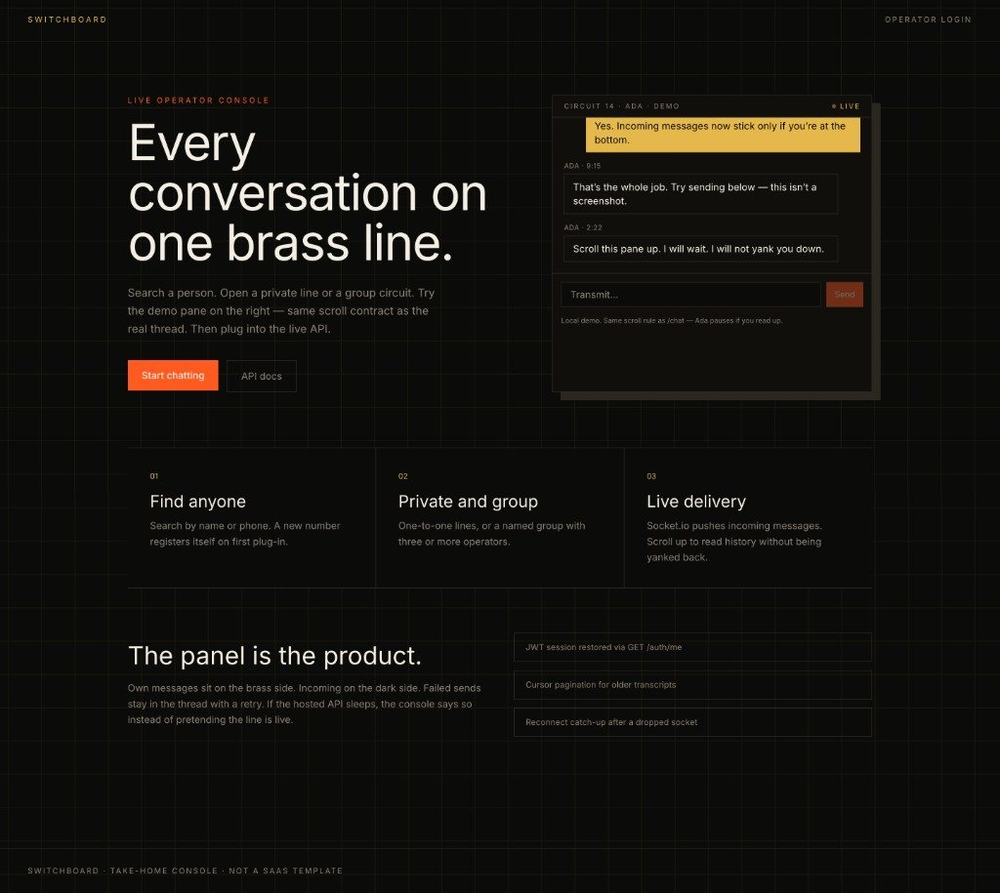
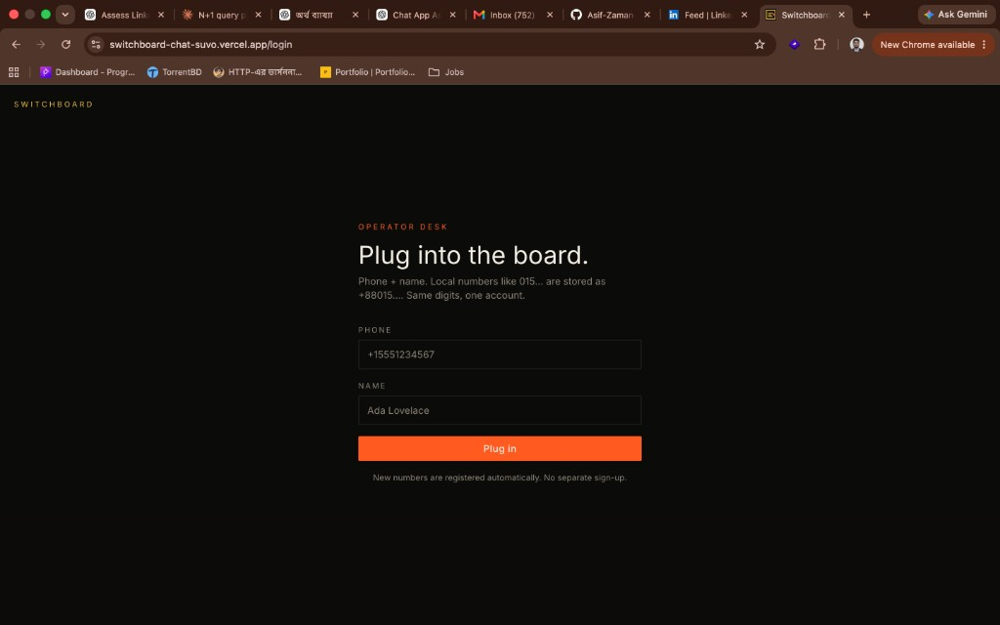
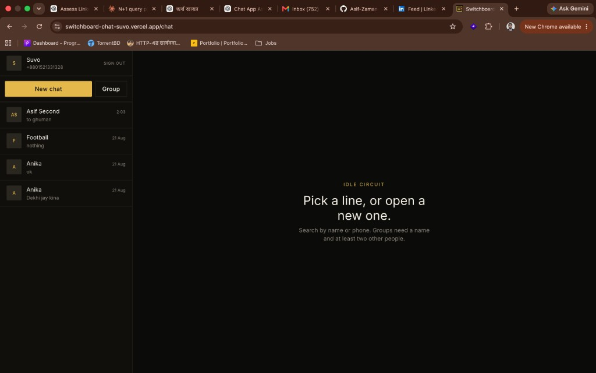
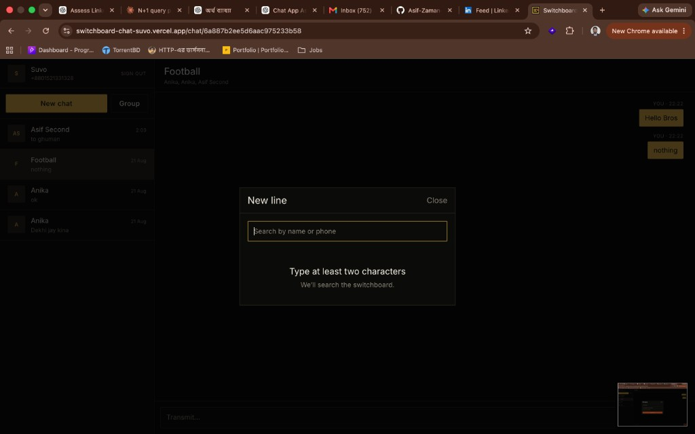
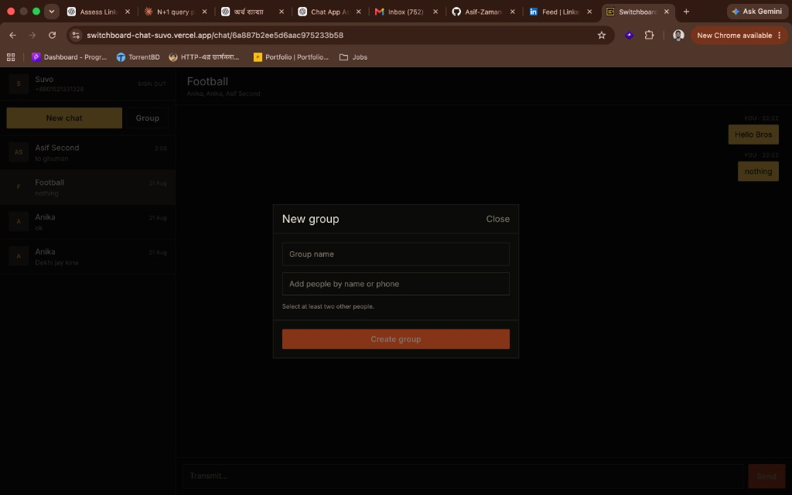

# Switchboard

Take-home chat app: document the mock API, then ship 1-to-1 + group chat and a landing page as **one Next.js app**.

**Live demo**

- Landing (Part 2): [https://switchboard-chat-suvo.vercel.app/](https://switchboard-chat-suvo.vercel.app/)
- Chat (Part 1): [https://switchboard-chat-suvo.vercel.app/chat](https://switchboard-chat-suvo.vercel.app/chat)
- Repo: `Asif-Zaman-Suvo/Switchboard-Chat`

| Part | What | Route |
| --- | --- | --- |
| 2 | Landing | `/` |
| 1 | Login | `/login` |
| 1 | Conversation list | `/chat` (unsigned → `/login`) |
| 1 | Thread | `/chat/[conversationId]` |
| 1 | API docs | [docs/API.md](docs/API.md) |

Local: [http://localhost:3000](http://localhost:3000).

---

## Screenshots

### Landing — `/`

Product page, not a SaaS template. Hero copy, three operator capabilities, and **Circuit 14**: a local demo of the real thread (send, Ada on a timer, pause if you scroll up). CTA goes to login.



### Login — `/login`

Phone + name. No separate sign-up — the API registers new numbers. Local `015…` is stored as `+88015…` so the same digits do not become two accounts in this client.



### Conversation list — `/chat`

Signed-in shell: identity, New chat / Group, conversation list with last message + time. With no thread selected, the right pane is **Idle circuit**.



### New 1:1 — search

**New line** searches the switchboard by name or phone (≥2 characters). Opening a person starts or reuses a direct conversation.



### New group

**New group** requires a name and at least two other people. Creates a named circuit; members show in the thread header.



---

## What is implemented

- Login with phone + name (API auto-registers). **Phones are canonicalized** before login (`015…` → `+88015…`) so local vs country-code forms do not create a second account in *this* app
- Search collapses users whose numbers match after canonicalization; prefers the `+` form. Searches both local and `+880` variants when the query looks like a phone
- JWT in `localStorage` (Zustand persist); restore via `GET /auth/me`
- Start / open 1-to-1; create a named group (≥2 other people)
- History, own vs other bubbles, timestamps, names (direct chats use API `participant`)
- Send via `POST /messages`; empty / whitespace blocked; optimistic send; failed bubble + Retry
- Socket.io `message:new` / `conversation:updated` over **same-origin polling** (`/backend/socket.io`). If the socket is down, lists refetch every 4s
- Stick-to-bottom; no force-scroll while reading older messages; “New messages” pill; `before` cursor for older pages
- Loading / empty / error on login, search, lists, send
- Mobile: list `/chat`, thread + Back `/chat/[id]`
- Landing + Framer Motion; Inter; **Part 2 bonus:** interactive Circuit 14 demo (send, Ada timer, pause on scroll up)
- Playwright e2e against the live mock API

Not built (API exists, PDF does not require UI): group add/remove/promote/rename.

---

## Stack

- **Next.js 16.3.2** App Router, React 19, TypeScript
- **Tailwind CSS 3** + **Inter**
- **TanStack Query**, **Zustand persist**, **Zod**, **Framer Motion**
- **socket.io-client** — path `/backend/socket.io`, `transports: ["polling"]`, `upgrade: false` (Vercel cannot proxy Engine.IO websocket upgrades; slash-redirects on `socket.io` were 308/404)
- **Playwright** — `e2e/` (6 Chromium specs)

Skipped: React Hook Form, shadcn, Redux, next-auth.

REST and Socket.io never call Render from the browser. Next/`vercel.json` rewrite `/backend/*` → `https://frontend-task-chatapp.onrender.com/*`. `skipTrailingSlashRedirect` is on so Engine.IO is not 308’d.

---

## Setup

```bash
npm install
cp .env.example .env.local
npm run dev
```

No required env vars. Optional comments live in `.env.example`. First hit after a Render sleep can take tens of seconds; the client retries REST 3 times.

| Command | |
| --- | --- |
| `npm run dev` | Turbopack |
| `npm run build` / `npm start` | production |
| `npx playwright install chromium` | once |
| `npm test` | Playwright (reuses `:3000` if already up) |
| `npm run test:ui` / `npm run test:headed` | UI / headed |

Playwright: landing CTA, demo pane send, empty login, `/chat` gate, new-phone register, search `Ada`, whitespace send disabled.

---

## Architecture

```
app/                 /, /login, /chat, /chat/[id]
components/landing   landing + Circuit 14 interactive demo
components/chat      shell, sidebar, pane, dialogs, login
components/ui        primitives
lib/api              fetch, mappers, users/conversations/messages
lib/phone.ts         canonicalize + search dedupe
lib/realtime         socket singleton
hooks                session, socket, stick-to-bottom
stores               Zustand session
e2e                  Playwright
docs/API.md          Part 1 API documentation
next.config.ts       rewrites + skipTrailingSlashRedirect
vercel.json          same rewrites for production
```

Chat is a client tree. Landing is client because of Motion. `lib/api/mappers.ts` turns live JSON into UI types (`_id` → `id`, direct `participant`, `{ messages, hasMore }`).

---

## Deploy

GitHub → Vercel (this project is already at the URLs above). Do **not** set `NEXT_PUBLIC_API_URL` to the Render origin — that reintroduces CORS.

---

## Part 3 — Thought process

One App Router app so Parts 1 and 2 share a deploy. Chat is client-only: JWT, Socket.io, and stick-to-bottom cannot live in RSC. TanStack Query owns server cache; Zustand only stores `{ token, user }`. Madagascar.

**Landing:** switchboard palette (ink / brass / signal), Inter. **Part 2 bonus:** the hero Circuit 14 pane is a local demo of the real chat contract — you can send, Ada replies on a timer, scrolling up **pauses** the script (no yank), “New messages” resumes live. Not a FAQ or testimonial block.

**Phone identity:** the mock API keys users on the raw `phone` string, so `01521331328` and `+8801521331328` are two rows. We cannot delete theirs. We canonicalize on login (`0…` → `+880…`) and unique-by-canonical-phone in search so the product treats them as one person. Ghost API rows can remain.

**Vercel:** browser → Render was CORS-blocked (login) and Engine.IO was 308/404 on `/backend/socket.io` (dot in the path + trailing-slash redirect). Fix: same-origin `/backend` proxy, explicit `socket.io` rewrite, polling only. 4s REST catch-up if the socket is down — labeled as reconnect, not as “websocket”.

**Trade-offs:** no group-admin UI; “Load earlier” not infinite scroll; localStorage JWT (their API cannot set httpOnly cookies on our domain).

### AI usage

Cursor: OpenAPI extract, scaffold, Motion, Playwright, Vercel proxy, phone canonicalization, README drafts. Mapper/scroll/switchboard look were kept as product calls. Template landing and calling REST-interval “realtime” were rejected.

### API issues and workarounds

Full list in [docs/API.md](docs/API.md): request-only Swagger; `_id`; `{ data }` vs array vs `{ messages, hasMore }`; direct `participant`; `sender` as id; `conversation` not `conversationId`; **400** `NO_TOKEN`; health on origin not `/api`; Render cold start; duplicate phones by format.

### If there were more time

Group admin UI, two-browser Playwright for `message:new`, merge/hide duplicate *conversations* that already exist for both phone forms.
